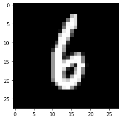
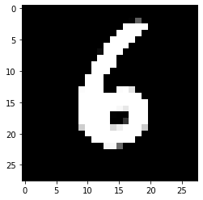

# Convolutional-VAE
minimal implementation of convolutional-variational autoencoders for reference

Currently this code is tailored specifically for MNIST dataset only.
Steps to get this working
1) Create a folder `saved_models` to save the models at every checkpoints.

### Original image (normalised):

### Reconstructed image:

